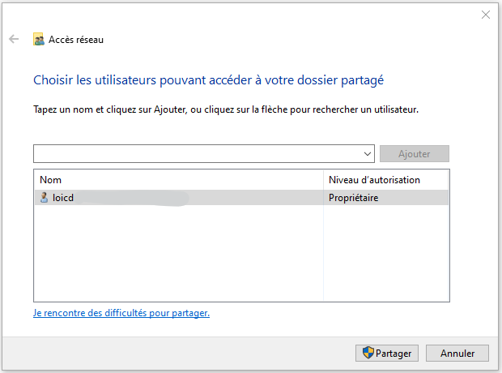
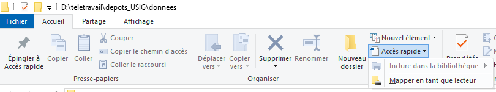
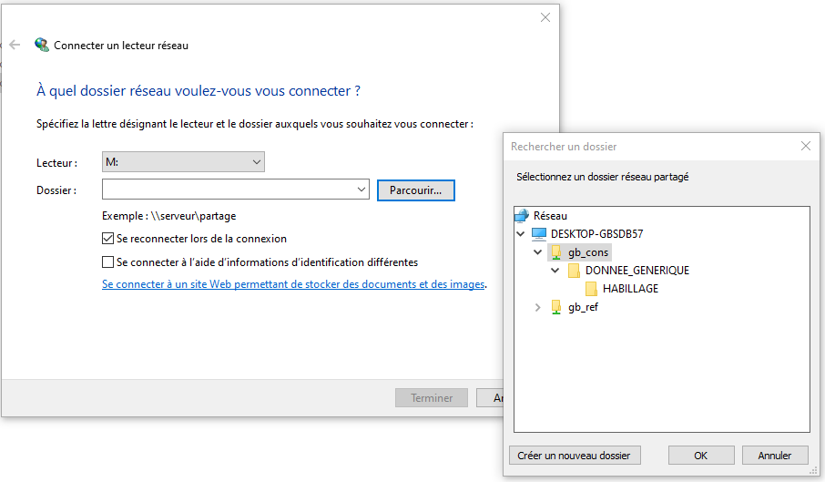

# Instructions

Ici se trouve le fichier GEOBASE.zip qui contient l'arborescence de fichiers nécessaires à l'affichage dans QGIS du projet de base de l'atlas 2019.

## 1. Télécharger **GEOBASE.zip** puis le décompresser dans un répertoire de votre choix. 

Voici à quoi ressemble GEOBASE.ZIP une fois dézippé: 

Sur cette image, on voit que **GEOBASE.zip** a été décompressé dans D:/teletravail

## 2. Partager les répertoires GB_CONS et GB_REF.

Cliquer droit sur le répertoire GB_CONS, choisir **Propriétés**, cliquer sur l'onglet **Partage**:

puis cliquer sur **Partager**

Dans la fenêtre **Accès réseau**, cliquer seulement sur **Partager**.

Le répertoire **GB_CONS** est partagé sur votre réseau. Faites de même avec **GB_REF**.

## 3. Connecter les lecteurs réseau M et N

Dans l'explorateur de fichier, onglet **Accueil**, cliquer sur **Accès rapide**, puis sur **Mapper en tant que lecteur**

La fenêtre **Connecter un lecteur réseau** s'ouvre alors.
Dans le champ **Lecteur** choisir **M**, et cliquer sur **Parcourir...**, patienter un peu et sélectionner **gb_cons**, puis cliquer sur **OK**.
Veiller à ce que la case à cocher **Se reconnecter à la connexion** soit cochée.

