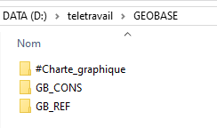
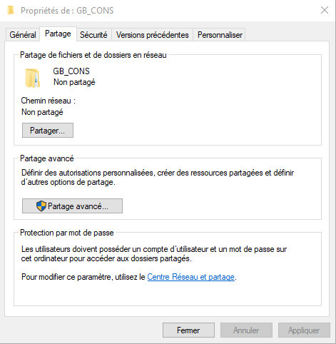

# Instructions

Ici se trouve le fichier GEOBASE.zip qui contient l'arborescence de fichiers nécessaires à l'affichage dans QGIS du projet de base de l'atlas 2019.

1. Télécharger **GEOBASE.zip** puis le décompresser dans un répertoire de votre choix. 
Voici à quoi ressemble GEOBASE.ZIP une fois dézippé: 

2.Partager les répertoires GB_CONS et GB_REF.
Cliquer droit sur le répertoire GB_CONS, choisir **Propriétés**, cliquer sur l'onglet **Partage**:

puis cliquer sur **Partager**
